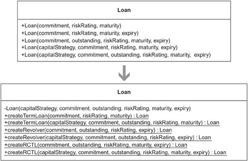
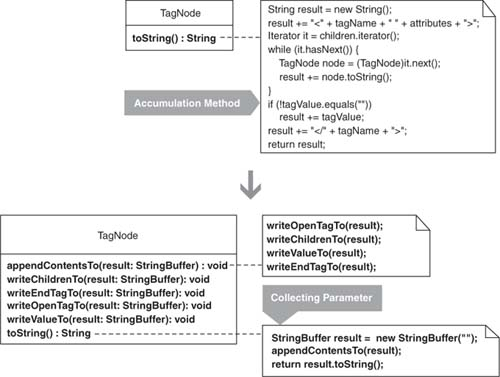
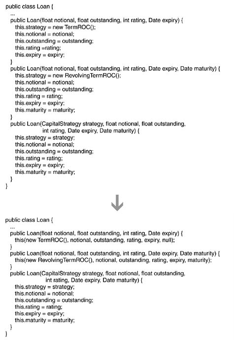

# Refactoring to Patterns Notes
My personal notes from: 'Refactoring to Patterns' by Joshua Kerievsky 

# CH6: Creation
## Replace  constructors with intention-revealing Creation Methods
- Constructors on a class make it hard to decide which constructor to call
- The more constructors you have, the easier it is for programmers to choose the wrong one
- A Creation Method is useful here. A Creation Method is a static or nonstatic method on a class that instantiates new instances of the class



## Strategy:
- 1. Find Chain Constructor (catch-all constructor)
- 2. Extract Method from the constructor. This new method is a creation method.
- 3. Find all constructors that instantiate the same kind of instance and call the creation method
- 4. If the chosen constructor is chained to another constructor, make the creation method call the chained constructor instead of the chosen constructor
- 5. If a constructor on the class has no callers outside the class, make it non-public


# CH9: Protection
## Introduce Null Objects
- If you have conditional logic that checks for null value, refactor it to use a Null Object
- This benifit removes the need to check whether a field or variable is null by making it possible to always call the field or variable safely

## Strategy:
- 1. Create a null object by applying Extract Subclass
- 2. Look for a null check
- 3. Apply the null object to the class that checks for null types

### Example
- Before:
```java
if (getState().equals(REQUESTED))  // equality logic with type-unsafe string constant
 setState(PermissionState.CLAIMED);
```
- After (Introducted Null Object):
```java
if (getState().equals(PermissionState.REQUESTED))
 setState(PermissionState.CLAIMED);
```

### Another Example
- Before:
```java
public boolean mouseMove(Event event, int x, int y) {
    if (mouseEventHandler != null)
      return mouseEventHandler.mouseMove(graphicsContext, event, x, y );
    return true;
  }
```
- After
  - Created NullMouseEventHandler with appropriate method that addresses null result
```java
public class NullMouseEventHandler extends MouseEventHandler {
  public NullMouseEventHandler(Context context) {
    super(context);
  }
  public boolean mouseMove(MetaGraphicsContext mgc, Event event, int x, int y) {
    return true;
  }
}
```
- Changed null occurances back in super class:
```java
private MouseEventHandler mouseEventHandler = new NullMouseEventHandler();
  public boolean mouseMove(Event event, int x, int y) {
    if (mouseEventHandler != null)
      return mouseEventHandler.mouseMove(graphicsContext, event, x, y );
    return true;
  }
```

# CH10: Accumulatation
## Use Objects to accumulate information
- Instead of accumulateing info to a local variable, accumulate results to a Collecting Parameter that gets passed to extracted methods



## Strategy:
- 1. Identify an accumulation method, a method that accumulates information into a result. The result, a local variable, will become a Collecting Parameter. If the result’s type won’t let you iteratively gather data across methods, change its type. For example, Java’s String won’t let you accumulate results across methods, so use a StringBuffer
- 2. Extract 

### Example
- Before: 
```java
class TagNode...
   public String toString() {
      String result = new String();
      result += "<" + tagName + " " + attributes + ">";
      Iterator it = children.iterator();
      while (it.hasNext()) {
         TagNode node = (TagNode)it.next();
         result += node.toString();
      }
      if (!value.equals(""))
         result += value;
      result += "</" + tagName + ">";
      return result;
   }
```
- After:
  - Used StringBuffer instead of result
```java
StringBuffer result = new StringBuffer("");
```
  - `result += "<" + tagName + " " + attributes + ">";` is extracted to a method:
```java
private void writeOpenTagTo(StringBuffer result) {
  result.append("<");
  result.append(name);
  result.append(" ");
  result.append(attributes.toString());
  result.append(">");
}
```
  - The original code now looks like this:
```java
StringBuffer result = new StringBuffer("");
writeOpenTagTo(result);
```
  - `result += node.toString();` is extracted to:
```java
public String toString() {
   StringBuffer result = new StringBuffer("");
   appendContentsTo(result);
   return result.toString();
}

private void appendContentsTo(StringBuffer result) {
   writeOpenTagTo(result);
   ...
}
```
  - The original code finally becomes:
```java
private void writeChildrenTo(StringBuffer result) {
   Iterator it = children.iterator();
   while (it.hasNext()) {
      TagNode node = (TagNode)it.next();
      node.appendContentsTo(result);
   }
   if (!value.equals(""))
      result.append(value);
}
```
# CH11: Utilities
## Chain Constructors
- Multiple constructors that contain duplicate code can be refactored to chain constructors
- This fixes situations like adding new variables to a class and neglecting updating constructors



## Strategy:
- 1. Find 2 constructors containing duplicate code. Determine if one can call the other and remove duplicate code from one of them
- 2. Then make the one constructor call the other one
- 3. Change  visibility of any constructors that may not need to be public

### Example
- Before:
```java
public Loan(float notional, float outstanding, int rating, Date expiry) {
   this.strategy = new TermROC();
   this.notional = notional;
   this.outstanding = outstanding;

this.rating = rating;
   this.expiry = expiry;
}

public Loan(float notional, float outstanding, int rating, Date expiry, Date maturity) {
   this.strategy = new RevolvingTermROC();
   this.notional = notional;
   this.outstanding = outstanding;
   this.rating = rating;
   this.expiry = expiry;
   this.maturity = maturity;
}

public Loan(CapitalStrategy strategy, float notional, float outstanding, int rating,
         Date expiry, Date maturity) {
   this.strategy = strategy;
   this.notional = notional;
   this.outstanding = outstanding;
   this.rating = rating;
   this.expiry = expiry;
   this.maturity = maturity;
}
```
- After:
  - First constructor can call the third with a minimum amount of work and no duplication:
```java
public Loan(float notional, float outstanding, int rating, Date expiry) {
   this(new TermROC(), notional, outstanding, rating, expiry, null);
}
```
  - Second constructor can also call the third constructor:
```java
public Loan(float notional, float outstanding, int rating, Date expiry, Date maturity) {
   this(new RevolvingTermROC(), notional, outstanding, rating, expiry, maturity);
}
```
